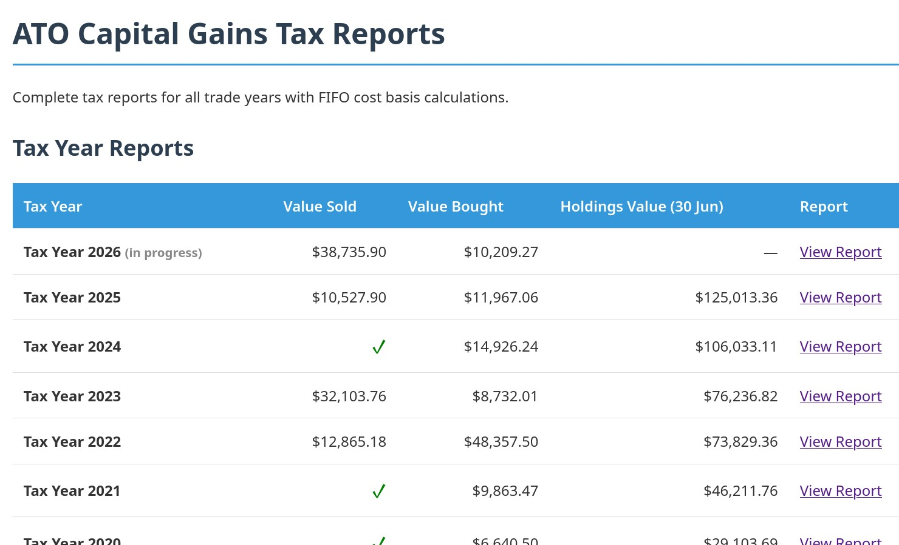
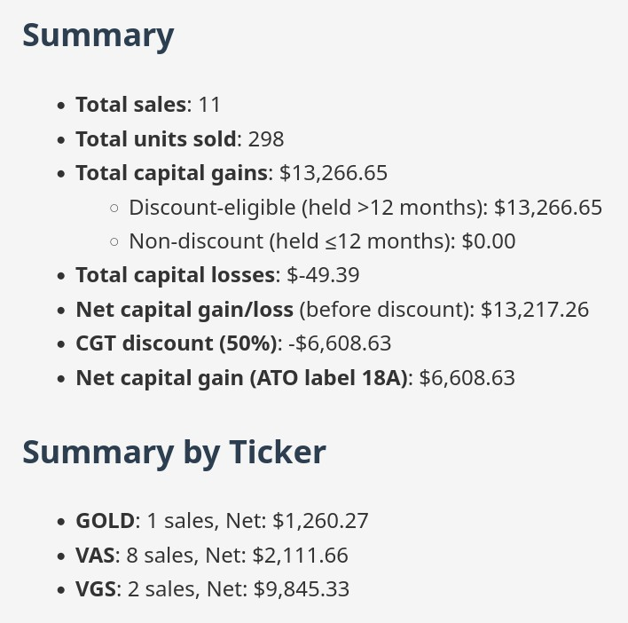

# ATO Record Keeper

Capital gains reporting for Australian tax. FIFO cost basis, CGT discount, ATO-ready.

Track trades as simple markdown files. Generate annual tax reports with one command.





## Quick Start

```bash
make setup                                  # install dependencies
cp input/template.md input/2026/2026-02-15-buy-vas.md
# edit the YAML fields
make all                                    # generate reports
```

Reports output to `output/html/` and `output/markdown/`.

## Trade File Format

```yaml
---
date: 2026-02-15
time: 10:30
action: buy
ticker: VAS
quantity: 10
price: 94.50
value: 945.00
fee: 6.50
contract_note: 2026-02-15-buy-vas.pdf
---
```

Files go in `input/YYYY/` as `YYYY-MM-DD-ACTION-TICKER.md`.

## Project Layout

```
input/              Trade records (one .md per trade, by year)
imports/            Contract notes and broker evidence
scripts/            FIFO calculator, index generator, holdings valuator
output/             Generated HTML and markdown reports
```

## What the Reports Cover

- FIFO lot matching for capital gains/losses
- 50% CGT discount for assets held >12 months
- Net capital gain (ATO label 18A)
- Holdings valuation per tax year
- Full transaction history with fees

## Requirements

Python 3, pandoc. Run `make setup` to install Python dependencies.
